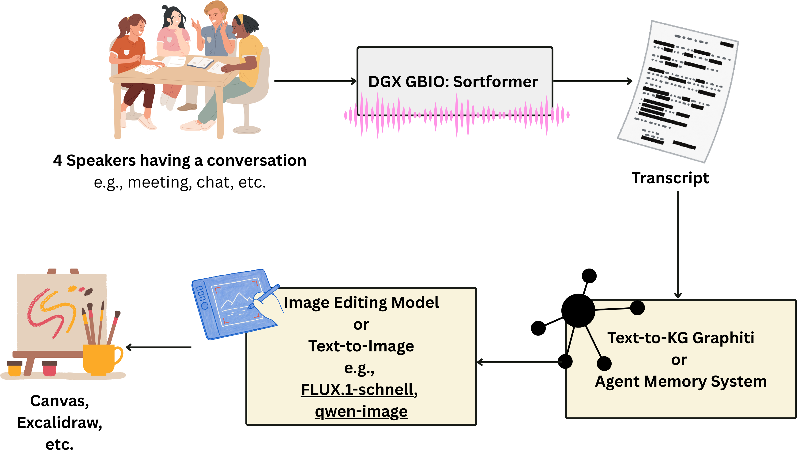

# convograph

A pipeline for turning multi-party spoken conversation into a temporal knowledge graph and an agent memory system (AMS), with an optional path to real-time visual output (graphic recording).

<p align="center">
  
</p>

<p align="center">
  <sub><b>Where we are heading.</b> Four people talk. Diarization turns the audio into a
  speaker-tagged transcript; a temporal knowledge graph accumulates what was said and
  what has since been revised; a visual stage renders it onto a canvas that keeps
  updating as the meeting goes on — a <i>graphic recording</i>, produced live.<br>
  This is the target picture, not the current state: modules 1 (Sortformer
  diarization + multitalker transcription) and 2 are built, module 3 is in
  progress. FLUX.1-schnell and Excalidraw remain candidates under evaluation,
  not decisions.</sub></p>

## Research question

How well can domain adaptation from agent memory be done from multi-party human conversation? Concretely: given what person X said over N weeks of conversation, filter the relevant subgraph and use it to adapt/ground an agent's memory — and quantify how well that adaptation works.

## Pipeline

```
audio (4 speakers)
  -> [1] ASR + diarization  ---------------->  speaker-tagged transcript
  -> [2] temporal KG + agent memory system --> temporal KG, quantitative ablation results
  -> [3] graphic generation ----------------->  caption -> image -> editable canvas (future)
```

Modules are independent and communicate through the data contracts in [`schemas/`](schemas/). See [`docs/architecture.md`](docs/architecture.md) for the full picture.

## Modules

| Module | Path | Status | Description |
|---|---|---|---|
| ASR + diarization | [`modules/asr-diarization`](modules/asr-diarization) | **working** | Streaming 4-speaker diarization + speaker-attributed transcription (NVIDIA Streaming Sortformer + multitalker Parakeet, DGX GB10), offline + live mic, DER-scored on AMI-derived 2/3/4-speaker mixes. RTF ~0.06 → real-time capable. Exports schema-valid transcripts. |
| Temporal KG + agent memory | [`modules/kg-agent-memory`](modules/kg-agent-memory) | **working, measured** | Transcript → temporal KG (Graphiti + Neo4j) with a bi-temporal `invalid_at` layer, evaluated on GroupMemBench. Full Finance domain ingested: 5,810 episodes / 111,258 facts / 18,450 superseded. Browsable live — see the module README. |
| Graphic generation | [`modules/graphic-generation`](modules/graphic-generation) | **in progress** | Caption -> FLUX.1-schnell image -> embedded Excalidraw element scripted (needs a GPU to actually run); fact-card board copied in from module 2. Planned MCP bridge to Excalidraw for an editable, real-time graphic-recording canvas is not started. |

## Adding a new module

See [`scripts/import_module.sh`](scripts/import_module.sh) — handles both "here's a zip" and "here's a git repo" cases. Each module should stay self-contained (own README, own dependency file, own run scripts) and document how its inputs/outputs map to [`schemas/`](schemas/).

## Status

Early stage, modules land independently before full end-to-end assembly. The first inter-module hop (1 -> 2) is wired and verified — run `python3 pipeline/check_handoff.py` (no GPU/LLM needed). A unifying UI is planned once the pipeline stabilizes (see [`pipeline/`](pipeline)).

## License

MIT — see [`LICENSE`](LICENSE).
