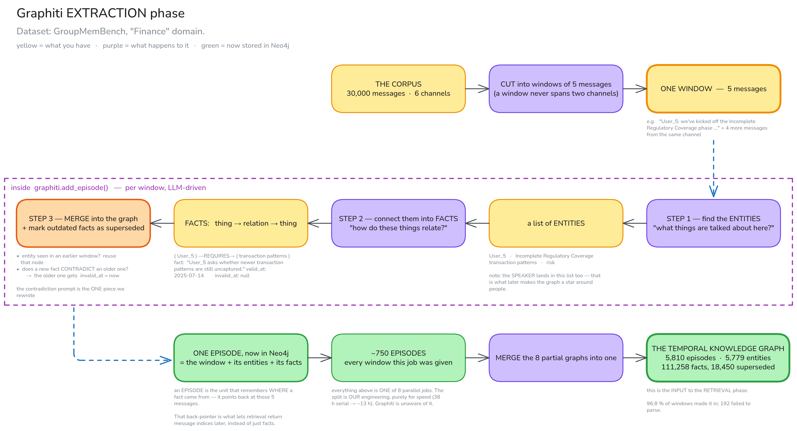
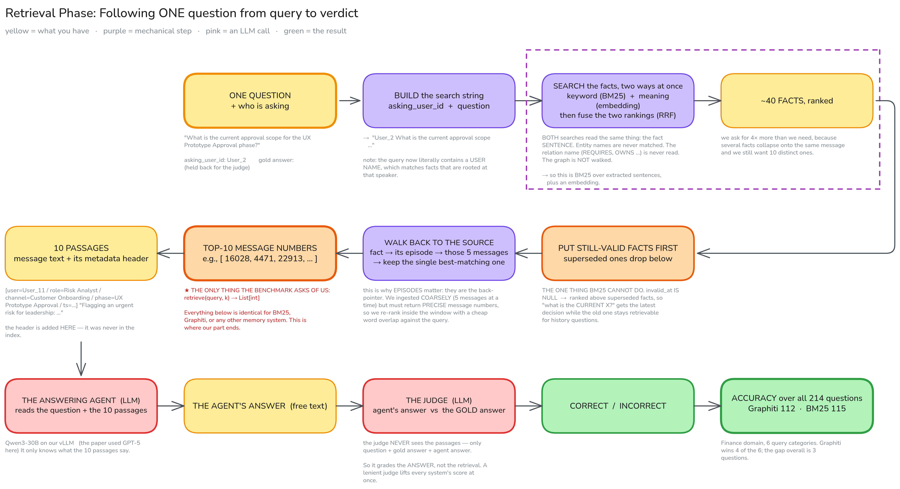
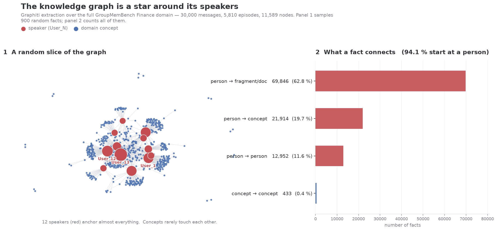

# Module 2 — Knowledge-Graph Generation

*Graphic Recording pipeline · DFKI DSA · maintained by Faris Abuali*

> **Part of [convograph](../../README.md)** — this is **Module 2**, the temporal
> knowledge graph + agent memory stage. Its message and question formats are the
> basis for [`schemas/temporal-kg.schema.json`](../../schemas/temporal-kg.schema.json).
>
> Large files under `data/final/**/*.json` are tracked with **Git LFS** (see this
> folder's `.gitattributes`). Run `git lfs install && git lfs pull` before using
> them, or they will look like 130-byte text stubs.

This module turns a conversation transcript into a temporal knowledge graph:

```
 Module 1              Module 2  ← you are here          Module 3
 Audio → Text          Text → Temporal Knowledge Graph  KG → Image
 (diarization)         (Graphiti + Neo4j)               (canvas / whiteboard)
```

It turns a **multi-party conversation transcript** into a **temporal knowledge
graph** — a graph that records not only *what* was said, but *when a statement
stopped being true*, so a later decision supersedes an earlier one.

It is built on [GroupMemBench](https://github.com/UCSB-NLP-Chang/GroupMemBench)
(its original README is kept as [`README.upstream.md`](README.upstream.md)),
which supplies the conversations, the questions, and the scoring loop. Everything
under `baselines/graphiti/`, `scripts/`, `analysis/`, `excalidraw/` and
`figures/` is ours.

---

## 1. What it does

Two phases. Both diagrams follow a **single item** end to end, so you can read
them without knowing the code.

### Extraction — building the graph



<sub>**Figure 1 — Extraction.** Following a single window of 5 messages from the raw
corpus to the finished knowledge graph. Yellow = what you have at that point,
purple = what happens to it, green = now stored in Neo4j. The dashed band is
everything Graphiti does inside one `add_episode()` call. Grey notes give a
concrete example at each checkpoint.</sub>

### Retrieval — asking the graph a question



<sub>**Figure 2 — Retrieval.** Following a single question from query to verdict.
Pink = an LLM call. The orange box in row 2 is the only thing GroupMemBench asks
of a memory system — `retrieve(query, k) → List[int]`; everything after it is
identical for BM25, Graphiti, or any other system.</sub>

> The `.excalidraw` sources sit next to the PNGs and are editable — open them at
> [excalidraw.com](https://excalidraw.com) or with the VS Code Excalidraw extension.
> (`*-v2` are the landscape versions shown here; the original tall v1 layouts are
> kept alongside them.)

---

## 2. What we have built

The full **Finance** domain of GroupMemBench — all 6 channels, all 30,000
messages — is ingested into one temporal knowledge graph:

| | |
|---|---:|
| episodes (windows of 5 messages) | 5,810 |
| entities | 5,779 |
| facts (`RELATES_TO` edges) | 111,258 |
| …of which **time-superseded** (`invalid_at` set) | **18,450** |
| window coverage | 96.8 % |

Building it takes ~38 h of GPU serially, so the ingest is **sharded into 8
parallel SLURM jobs** and is **resumable** — a job killed at the 23 h walltime
resumes in ~2 h instead of restarting.

Everything runs **fully local**: Qwen3-30B and bge-m3 served by vLLM on one
Pegasus node, Neo4j on the same node, all over `localhost`. No external API, no
key, no quota.

---

## 3. What we measured

**Finance domain, 214 questions, 6 query categories.** Graphiti and BM25 were run
in the *same job*, against the *same corpus*, judged by the *same* model — so the
only difference between the two columns is the retrieval method.

| Query category | Graphiti | BM25 |
|---|---:|---:|
| Multi-Hop | **29 / 48** | 28 / 48 |
| Knowledge Update | 9 / 32 | **15 / 32** |
| Ambiguity | **21 / 45** | 19 / 45 |
| Implicit | 10 / 15 | **13 / 15** |
| Temporal | **20 / 45** | 18 / 45 |
| Abstention | **23 / 29** | 22 / 29 |
| **Total** | **112 / 214 (52.3 %)** | **115 / 214 (53.7 %)** |

**Read this as a tie.** Graphiti wins 4 of 6 categories and trails by 3 questions
overall, which is inside the run-to-run noise we measured (~1–2 questions).

<details>
<summary><b>Is our harness trustworthy?</b> (yes — we reproduced the paper's BM25)</summary>

We re-ran BM25 on **all four domains** and compared against the paper's own
per-domain tables (Appendix G). Micro-average, ours vs theirs:

| Domain | Ours | Paper | Δ |
|---|---:|---:|---:|
| Technology | 47.9 | 46.0 | +1.9 |
| Healthcare | 46.2 | 43.1 | +3.1 |
| Manufacturing | 48.0 | 41.1 | +6.9 |
| Finance | 52.8 | 42.1 | +10.7 |
| **Pooled** | **49.0** | **43.2** | **+5.8** |

+5.8 overall, while substituting **Qwen3-30B for GPT-5** as both answering agent
and judge. Close enough to trust the instrument; large enough that our absolute
numbers should always be quoted *with* the offset rather than dropped into the
paper's table.
</details>

---

## 4. The main finding



**The graph is a star around its speakers, not a graph of the Finance domain.**
**94.1 %** of facts start at a person; only **0.4 %** (433 of 111,258) join two
domain concepts. The twelve highest-degree nodes *are* the twelve users —
`User_13` alone has degree 17,814.

A second defect shows up in the same census: **80 % of entities are sentence
fragments** (`drift`, `risk`, `edge cases`) rather than things, which is why the
largest bar above is `person → fragment`. Those act as false junctions — 68 facts
about unrelated topics all hang off a node called `drift`.

Graphiti retrieves by walking entities, so if nearly every edge runs
`speaker → concept`, every path between two topics detours through a `User_N` hub
wired to thousands of things. Multi-hop retrieval has nothing to walk.

**Why it happens:** we render each episode as `User_5: <text>`, which makes the
speaker the grammatical subject of every sentence. The extractor is doing exactly
what it was asked to.

### Six interventions, all measured null

| # | What we tried | Result |
|---|---|---|
| 1 | Entity stitching across shards (vs no stitching) | 9/32 → 9/32 |
| 2 | One `group_id` per channel | impossible — 10 of 12 users span >1 channel |
| 3 | Oracle channel scoping at query time | Graphiti 9 → 9 (BM25 15 → 18) |
| 4 | `kgfacts` — BM25 over the KG's fact text, no entity layer | 9 → 10 |
| 5 | **BFS graph traversal** (Graphiti supports it; we had it off) | 112 → 111 / 214 |
| 6 | **Reframing the speaker** as `[said by User_5] <text>` | 89.6 % → 90.4 % person-rooted |

Every one of these is a *retrieval-side* fix, and none moved the number. That is
consistent, replicated evidence that the limit sits **upstream, in extraction** —
not in how we search.

**The next lever is structural:** constrain the extractor with `entity_types` /
`edge_types` schemas, so speaker-rooted facts become *impossible to emit* rather
than merely discouraged. Intervention 6 shows that asking politely, in prose, does
not work on this model.

---

## 5. Browse the graph yourself

The most useful thing you can do with this repo is *look at the graph*. Two ways
in — pick whichever suits you.

### Two ways to get it running

| | Setup | Best for |
|---|---|---|
| **A. Hosted — AuraDB** | none — open Neo4j Browser, paste 3 values | anyone; no Neo4j account, no cluster access |
| **B. Local — Docker** | one script; needs Pegasus access to fetch the store | working offline, or running the eval code against it |

#### A · Hosted — no install, no account

The full graph is loaded into a Neo4j AuraDB instance. **You do not need a Neo4j
account to browse it.** Neo4j Browser is a client-side web app: open it, paste the
connection details, and you are in.

1. Go to **https://browser.neo4j.io**
2. In the connect dialog, enter:

| Field | Value |
|---|---|
| Connect URL | `neo4j+s://fa42f976.databases.neo4j.io` |
| Database | *(leave blank)* |
| Authentication type | Username / Password |
| Username | `fa42f976` |
| Password | *shared over Teams — deliberately not in this repo* |

3. Paste a query from [Starter queries](#starter-queries) below and hit ▶.

Verified contents: **11,589 nodes · 266,879 relationships · 5,810 Episodic ·
5,779 Entity · 18,450 superseded facts** — identical to the local store.

> **If it will not connect,** the instance is probably paused: free Aura instances
> pause after 3 days idle. Only the instance owner (Faris) can resume it, from
> [console.neo4j.io](https://console.neo4j.io) → **Graphic Recording** → Resume.
> That console *does* need an Aura account; browsing the data does not.

#### B · Local (Docker)

```bash
bash scripts/run_open_merged_kg.sh      # rsync the store from /fscratch + start Neo4j in Docker
```

Then open **http://localhost:7475** → connect to `bolt://localhost:7688`,
user `neo4j`, password `graphiti123`.

```bash
docker start neo4j-gmb-full             # afterwards, to bring it back up
docker stop  neo4j-gmb-full             # when you are done
```

Useful variants:

```bash
SKIP_SYNC=1 bash scripts/run_open_merged_kg.sh   # rebuild the container, no re-download
STORE=nostitch bash scripts/run_open_merged_kg.sh # the no-entity-stitching control graph
```

### Starter queries

**[`analysis/eyeball_kg.cypher`](analysis/eyeball_kg.cypher)** has ~15 commented
starter queries, ordered from *"is anything there"* to *"is the extraction any
good"*. Three to try first:

```cypher
// 1. A renderable picture — one episode and everything it touches
MATCH p = (e:Episodic)-[:MENTIONS]->(:Entity)-[:RELATES_TO]-(:Entity)
RETURN p LIMIT 40;

// 2. The bi-temporal layer: facts that were later superseded
MATCH (a:Entity)-[r:RELATES_TO]->(b:Entity)
WHERE r.invalid_at IS NOT NULL
RETURN a.name, r.name, b.name, r.fact, r.valid_at, r.invalid_at
LIMIT 25;

// 3. The star, in one query — the graph's biggest hubs are all people
MATCH (n:Entity)-[r:RELATES_TO]-()
RETURN n.name, count(r) AS degree ORDER BY degree DESC LIMIT 15;
```

**Schema in one paragraph.** `(:Episodic)` = one window of 5 messages.
`(:Entity)` = a thing the LLM extracted. `MENTIONS` links a window to a thing.
`RELATES_TO` is a **fact**: the English sentence is on `.fact`, `.valid_at` is
when it became true, and **`.invalid_at` is when it was superseded** — `null`
means still current. That last field is the whole bi-temporal story, and it is
the thing BM25 cannot represent at all.

---

## 6. Running it

Every entry point is a shell script in `scripts/` that logs to `logs/`.

```bash
bash scripts/setup_env.sh                 # local venv (this repo has its OWN)
bash scripts/sync_to_cluster.sh           # push code to Pegasus

# on Pegasus:
bash scripts/submit_shards.sh             # build the KG — 8 parallel resumable jobs
bash scripts/run_merge_shards.sh          # 8 partial graphs → 1
bash scripts/submit_qtypes.sh             # score all 6 query categories
bash scripts/run_bm25_reproduction.sh     # BM25 vs the paper, per domain
```

---

## 7. Layout

```
baselines/graphiti/
  graphiti_retriever.py     ingest + retrieve(query, k) -> List[int]   ← the core
  prompts_override.py       our ONE prompt change: meeting-aware contradiction
                            detection, so an implicit revision supersedes a fact
  kgfacts_retriever.py      ablation: BM25 over the KG's fact text
  merge_shards.py           union 8 partial graphs, dedupe entities
scripts/                    every runnable entry point (.sh only), tee'd to logs/
analysis/                   census, ablations, audits, starter Cypher
excalidraw/                 the two journey diagrams (.excalidraw + .png)
figures/                    generated figures
data/, questions/           the GroupMemBench corpora and question sets (upstream)
```

**Graphiti is a plain pip dependency** (`graphiti-core==0.29.2`). We do not fork
it — `prompts_override.py` patches the installed library at import time. So
`pip install -r requirements.txt` is all you need; there is no second repo.

---

## 8. Status

**Frozen as of 2026-08-28.** The engine works end to end and is measured. Further
tuning is deliberately paused so effort can go to Modules 1 and 3, which are
still unvalidated.

Open questions for the pipeline:

- [ ] Does a constrained `entity_types` / `edge_types` schema break the star shape?
- [ ] `knowledge_update` is our worst category (9/32) despite 18,450 superseded
      facts sitting in the graph. The temporal data exists; something between
      storing it and answering with it fails.
- [ ] **What does "good" mean for Graphic Recording?** We optimise QA accuracy,
      but the deliverable is a *readable diagram*. A star graph around 12 users
      scores acceptably and would still make a poor graphic recording. This
      metric does not exist yet, and it decides what Module 2 should optimise.
